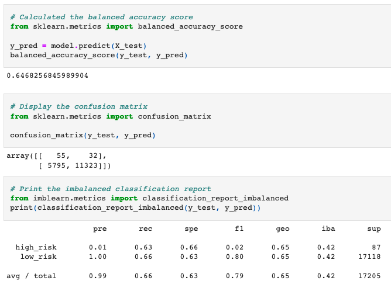
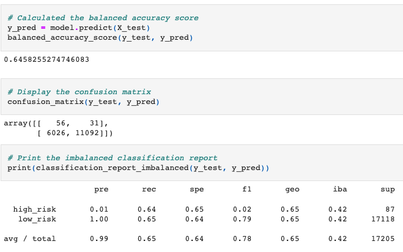
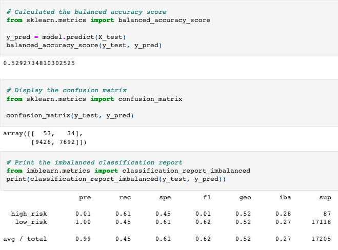
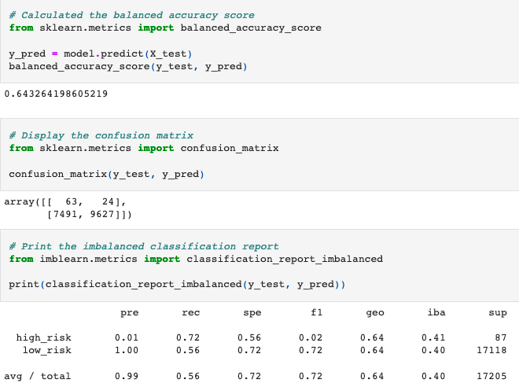
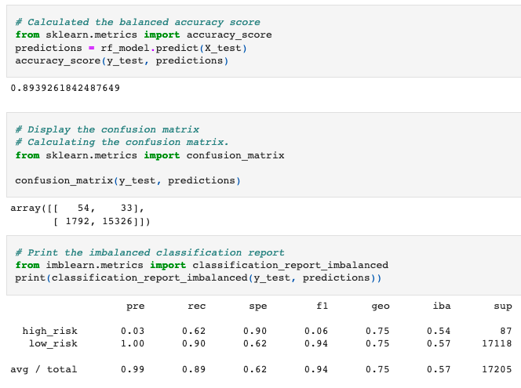
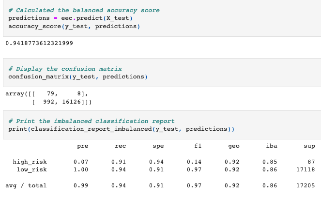

# Credit Risk Analysis
[Resampling Machine Learning Models](https://github.com/c-geisel/Credit_Risk_Analysis/blob/main/credit_risk_resampling.ipynb)

[Ensemble Machine Learning Models](https://github.com/c-geisel/Credit_Risk_Analysis/blob/main/credit_risk_ensemble.ipynb)

## Overview of the analysis
Analyzing credit risk poses a challenge being that it is an unbalanced classification problem. This is because the number of good loans outweigh the number of risky loans. In this analysis, different techniques are used to train and evaluate models with unbalanced classes. Many machine learning methods are used such as: 
-	Oversampling data randomly and through SMOTE
-	Under sampling data 
-	Using a combination approach of over and under sampling 
-	ensemble models. 
This is completed using imbalanced-learn and scikit-learn libraries. The models are then evaluated based on the performance and recommendations are given to decide whether they should be used to predict credit risk. 

## Results 
1. The first machine learning model used is a random oversampler to balance our dataset. 
    - Accuracy score of 64.7%
    - Precision high-risk: 1%
    - Recall high-risk: 63%

2. Next, another oversampling model is created using SMOTE. 
    - Accuracy score of 64.6%
    - Precision high-risk: 1%
    - Recall high-risk: 64%

3. An Undersampling model is used.
    - Accuracy score of 52.9% 
    - Precision high-risk: 1%
    - Recall high-risk: 61%

4. A combination SMOTEENN model is used that combines both over and undersampling techniques.
    - Accuracy score of 64.3% 
    - Precision high-risk: 1%
    - Recall high-risk: 72%

5. Ensemble techniques are also used to model the dataset. Here, a Random Forest model is used. 
    - Accuracy score of 89.4% 
    - Precision high-risk: 3%
    - Recall high-risk: 62%

6. Finally, an Easy Ensemble Model is used.
    - Accuracy score of 94.2% 
    - Precision high-risk: 7%
    - Recall high-risk: 91%

## Summary 
The purpose of this analysis is to assess credit risk when giving loans to applicants. We are concerned with high-risk measures as those indicate applicants that may serve as a bad loan investment. This is kept in mind when deciding the effectiveness of a machine learning model. Three aspects pertaining to each model are viewed, the precision, the recall(sensitivity), and the accuracy. 

Precision refers to how reliable a positive classification is. All in all, precision amounts are relatively low for all models with the highest value being at 7%. The majority of these values lie at around 1% showing that a reliable positive classification may not be an aspect that can be obtained through our models and could be of use to look for models with higher precision for high risk loans. 

Recall is thus the more relied upon predictor in our model analysis. Recall is the ability of a classifier to find all positive samples. SMOTE, SMOTEENN, and the Easy Ensemble Models all had high values for high-risk loans which refers to the model correctly identifying positive outcomes. 

Accuracy is used as an overall measure of how a model is performing. The Random Oversampler, Random Forest, and Easy Ensemble Models all had the highest accuracy showing that the models are performing well. 

Of the models tested, it is recommended that the Easy Ensemble model is used to assess credit risk in applicants as it has the highest accuracy score of 94.2%, the highest recall for low-risk applicants of 91%, and the highest precision of all models. However, it would serve as beneficial to test other possible models to find a method that would raise precision amounts for high-risk data classification.

